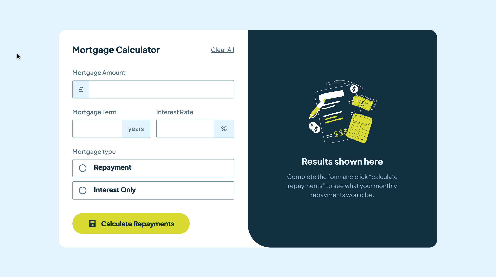
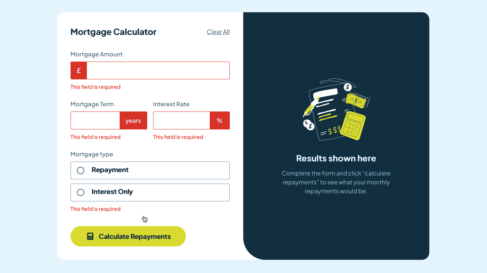
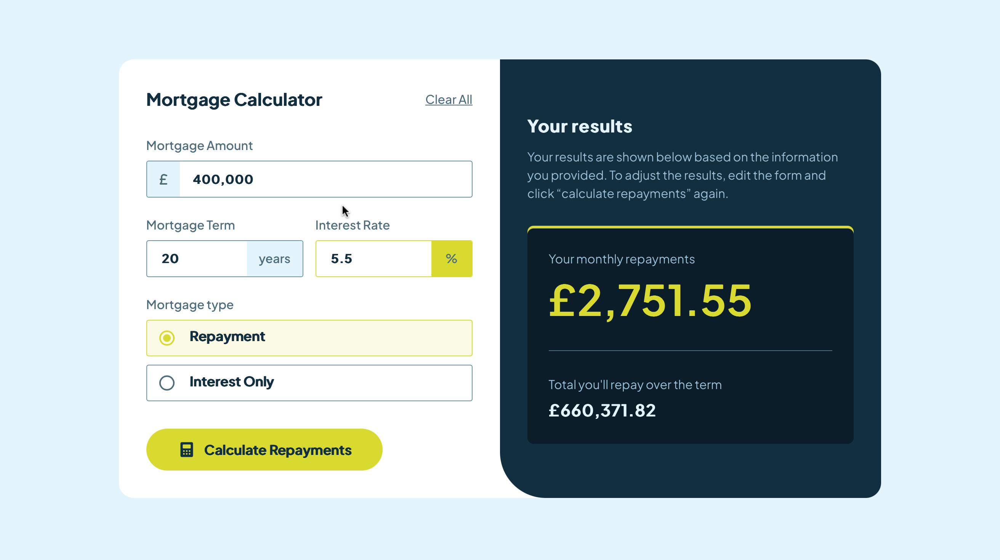
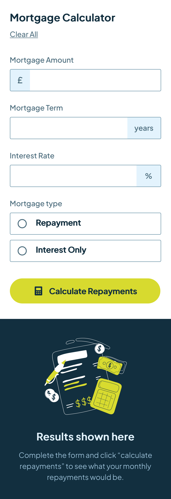
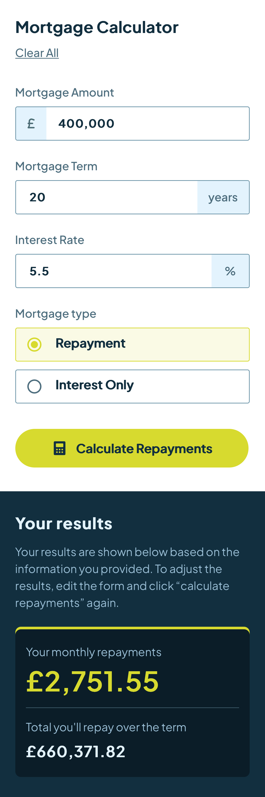

# Frontend Mentor - Mortgage repayment calculator solution

This is a solution to the [Mortgage repayment calculator challenge on Frontend Mentor](https://www.frontendmentor.io/challenges/mortgage-repayment-calculator-Galx1LXK73). Frontend Mentor challenges help you improve your coding skills by building realistic projects. 

## Table of contents

- [Overview](#overview)
  - [The challenge](#the-challenge)
  - [Screenshot](#screenshot)
  - [Links](#links)
- [My process](#my-process)
  - [Built with](#built-with)
  - [Useful resources](#useful-resources)
- [Author](#author)

**Note: Delete this note and update the table of contents based on what sections you keep.**

## Overview

### The challenge

Users should be able to:

- Input mortgage information and see monthly repayment and total repayment amounts after submitting the form
- See form validation messages if any field is incomplete
- Complete the form only using their keyboard
- View the optimal layout for the interface depending on their device's screen size
- See hover and focus states for all interactive elements on the page

### Screenshot
#### Desktop view:
<!--  -->

#### Mobile view:

 
### Links

- Solution URL: [URL solution here](https://github.com/sportif7/-Mortgage-repayment-calculator.git)
- Live Site URL: [live site URL here](https://sportif7.github.io/-Mortgage-repayment-calculator/)

## My process

### Built with

- Semantic HTML5 markup
- CSS custom properties
- Flexbox
- CSS Grid
- Mobile-first workflow

### Useful resources
 I would like to thank to Josh Comeau for his CSS reset I use: https://www.joshwcomeau.com/css/custom-css-reset/

## Author
 - Frontend Mentor - [Mario.H](https://www.frontendmentor.io/profile/sportif7)

